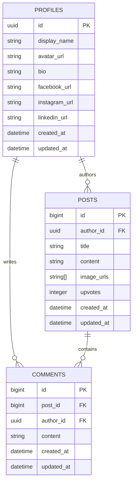

# Data Model and ERD

## Project

- **Project:** Volunteer Social Hub
- **Document:** Data Model and ERD
- **Status:** Approved for technical design
- **Related document:** `docs/01-mini-prd.md`

---

## 1. Data Modeling Principles

The data model must support the complete P0 feature set while preserving a straightforward path to authentication, user profiles, and ownership-based permissions.

The initial schema includes three application entities:

1. `profiles`
2. `posts`
3. `comments`

Authentication credentials are not stored in application tables. The authentication provider manages login email, password, and session data.

For the initial MVP, Supabase Row Level Security (RLS) is disabled to reduce database-policy setup during core feature development. The schema still stores `author_id` on posts and comments so the React application can provide the intended guest/member/author experience and so database authorization can be added later without redesigning ownership relationships.

The design intentionally does not include separate entities for:

- Upvotes
- Reactions
- Images
- Tags
- Projects
- Locations
- Messages
- Followers
- Notifications
- Post revision history

These features are either represented by a simple field or are outside the current MVP.

---

## 2. Entity: Profile

### Purpose

A profile stores the public application identity associated with an authenticated account.

Every post and comment must belong to a profile. The login email remains private and is not stored in the profile for public display.

### Fields

| Field | Required | Description |
|---|---:|---|
| `id` | Yes | Primary key matching the authenticated account ID |
| `display_name` | Yes | Name displayed on posts and comments |
| `avatar_url` | No | External avatar image URL |
| `bio` | No | Short profile description |
| `facebook_url` | No | Optional Facebook profile URL |
| `instagram_url` | No | Optional Instagram profile URL |
| `linkedin_url` | No | Optional LinkedIn profile URL |
| `created_at` | Yes | Profile creation timestamp |
| `updated_at` | Yes | Last profile update timestamp |

### Constraints

- `id` must be unique.
- `display_name` must not be empty after trimming whitespace.
- `display_name` does not need to be unique.
- Social links are optional.
- Login email must not be displayed as profile information.
- Phone number, home address, and residential area are not stored.

### Ownership

A profile belongs to exactly one authenticated account.

The profile owner may update their own display name and optional profile information when profile editing is implemented.

---

## 3. Entity: Post

### Purpose

A post represents content published to the community.

A post requires a title and may include text content and up to six ordered images from local uploads or direct external URLs.

### Fields

| Field | Required | Description |
|---|---:|---|
| `id` | Yes | Primary key |
| `author_id` | Yes | Foreign key referencing the author profile |
| `title` | Yes | Post title |
| `content` | No | Full text content |
| `image_urls` | Yes | Ordered array of zero to six uploaded or external image URLs |
| `upvotes` | Yes | Unlimited upward-arrow click count |
| `created_at` | Yes | Post creation timestamp |
| `updated_at` | Yes | Last post update timestamp |

### Constraints

- `title` must not be empty after trimming whitespace.
- `content` may be null or empty.
- `image_urls` defaults to an empty array.
- `image_urls` may contain at most six entries.
- `upvotes` defaults to `0`.
- `upvotes` cannot be negative.
- `author_id` must reference an existing profile.
- Multiple posts may have the same title.

### Current and Historical Data

The MVP stores only the current version of a post.

When a post is edited:

- `title`, `content`, and `image_urls` may change.
- `updated_at` changes.
- `created_at` remains unchanged.
- Previous versions are not preserved.

### Ownership

In the normal application flow, only the post author should be allowed to edit or delete the post. For the initial MVP, this check is performed in React because Supabase Row Level Security (RLS) is disabled.

---

## 4. Entity: Comment

### Purpose

A comment represents a response written beneath one post.

Every comment belongs to exactly one post and exactly one author profile.

### Fields

| Field | Required | Description |
|---|---:|---|
| `id` | Yes | Primary key |
| `post_id` | Yes | Foreign key referencing the parent post |
| `author_id` | Yes | Foreign key referencing the author profile |
| `content` | Yes | Comment text |
| `created_at` | Yes | Comment creation timestamp |
| `updated_at` | Yes | Last comment update timestamp |

### Constraints

- `post_id` must reference an existing post.
- `author_id` must reference an existing profile.
- `content` must not be empty after trimming whitespace.

### Ownership

The comment author may edit or delete their own comment when the stretch feature is implemented.

The ownership field is included from the beginning so comment editing and deletion can be added without redesigning the relationship.

### Current and Historical Data

The system stores only the current version of a comment.

When comment editing is implemented:

- `content` may change.
- `updated_at` changes.
- `created_at` remains unchanged.
- Previous comment versions are not preserved.

---

## 5. Relationships and Cardinality

### Profile to Posts

- One profile may author zero or many posts.
- Every post must have exactly one author profile.

```text
Profile 1 ───── 0..* Posts
```

### Profile to Comments

- One profile may author zero or many comments.
- Every comment must have exactly one author profile.

```text
Profile 1 ───── 0..* Comments
```

### Post to Comments

- One post may contain zero or many comments.
- Every comment must belong to exactly one post.

```text
Post 1 ───── 0..* Comments
```

---

## 6. Delete Behavior

### Delete Post

Deleting a post performs a hard delete.

The operation must also delete all comments belonging to that post.

```text
Delete Post
→ Delete all related Comments
→ Remove the Post
```

This behavior should be implemented using a cascading foreign-key relationship when the database schema is created.

### Delete Comment

Deleting an individual comment is a stretch feature.

When implemented:

- Only the comment author may delete it.
- Deleting a comment does not delete its parent post.
- The comment is permanently removed.

### Delete Profile or Account

Account deletion is outside the current MVP.

The behavior for posts and comments after account deletion will be decided before that feature is implemented.

---

## 7. Upvote Modeling

The approved product behavior allows one registered member to click the upward arrow any number of times.

The application does not need to record who clicked or prevent repeated clicks.

Therefore, the MVP uses one field:

```text
posts.upvotes
```

Each valid click performs:

```text
upvotes = upvotes + 1
```

A separate `post_upvotes` table is not required.

A separate table would become necessary only if the product later required:

- One vote per user
- Removing a vote
- Identifying voters
- Multiple reaction types
- Reaction analytics by user

---

## 8. Image Modeling

Posts store their ordered image list in:

```text
posts.image_urls
```

The array:

- Defaults to an empty array
- Contains at most six URLs
- Preserves the order in which images were added
- May contain Supabase Storage public URLs
- May contain direct external image URLs
- May contain a combination of both

Uploaded files are stored in the public `community-media` bucket under:

```text
<user-id>/posts/<unique-file-name>
```

A separate image table is not required because the application does not currently store:

- Per-image captions
- Per-image ownership
- Additional image metadata

---

## 9. Authentication and Profile Creation Assumption

The intended interaction model requires an account for all write actions.

### Guest

A guest may:

- View the feed
- Search and sort posts
- Open posts
- View images and comments
- See interaction controls

A guest may not:

- Create a post
- Submit a comment
- Increase the upvote count
- Edit content
- Delete content

Attempting a protected action displays a sign-in prompt.

### Registered Member

A registered member may interact with the application.

The simplest intended authentication flow is:

```text
Sign up with email and password
→ Provide a display name
→ Create a Profile linked to the authenticated account
→ Enter the application as a registered member
```

Google sign-in remains an optional future enhancement.

The initial MVP uses authentication plus frontend checks:

- Guests are prompted to sign in before normal write actions.
- Posts and comments are associated with authenticated profile IDs.
- Edit and delete controls are shown only to the matching author in the React UI.

Because RLS is disabled, these rules are not strongly enforced by the database against someone who bypasses the application interface. The MVP must use sample/demo content only. RLS and database authorization policies are required before using real private or organizational data.

---

## 10. Privacy-Sensitive Data

### Not Stored in Application Tables

- Password
- Login email for public display
- Phone number
- Home address
- Residential area

### User-Provided Optional Data

- Display name
- Avatar URL
- Bio
- Social links
- Post content
- Image URL
- Comments

The authentication provider manages login credentials. Application tables store only the data needed for the community experience.

---

## 11. Unique Constraints and Data Integrity

### `profiles`

- Primary key: `id`
- `display_name`: required, not unique
- `created_at`: automatically assigned
- `updated_at`: automatically assigned or updated by application logic

### `posts`

- Primary key: `id`
- `author_id`: required foreign key
- `title`: required
- `image_urls`: required array, default empty, maximum six entries
- `upvotes`: default `0`, minimum `0`
- `created_at`: automatically assigned
- `updated_at`: automatically assigned or updated by application logic

### `comments`

- Primary key: `id`
- `post_id`: required foreign key
- `author_id`: required foreign key
- `content`: required
- `created_at`: automatically assigned
- `updated_at`: automatically assigned or updated by application logic

---

## 12. ERD



---

## 13. Explicitly Excluded from the Initial Schema

The initial schema does not include:

- Tags
- Projects
- Locations
- Statuses
- Friends
- Followers
- Messages
- Notifications
- Bookmarks
- Reposts
- Reaction types
- Post history
- Comment history
- Moderation reports

These should be added only when the corresponding feature is approved for implementation.

---

## 14. Approved Decisions

1. Deleting a post deletes all comments belonging to it.
2. Comment editing and deletion are stretch features.
3. Comment ownership is modeled from the beginning.
4. The `profiles` entity is included from the beginning.
5. Every post must belong to one profile/account.
6. Every comment must belong to one profile/account.
7. An account is required for all write interactions.
8. Guest access is read-only.
9. Email/password authentication is the simplest intended initial approach.
10. Google sign-in remains optional.
11. Upvotes use one integer count and do not require a separate table.
12. The login email remains private.
13. RLS is disabled for the initial MVP to reduce database-policy setup during core feature development.
14. Frontend login and ownership checks define the normal MVP flow, but database-level authorization is deferred to a security-hardening milestone.
