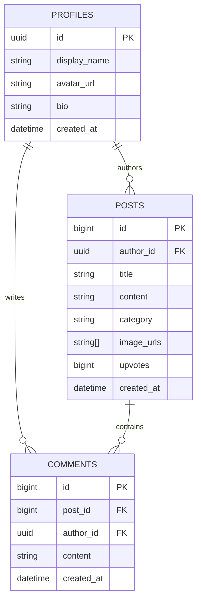

# Volunteer Social Hub — Data Model and ERD

Volunteer Social Hub uses Supabase for authentication, PostgreSQL data storage, and image storage.

The application uses three main public application tables:

- `profiles`
- `posts`
- `comments`

Supabase Auth manages account credentials and sessions separately from these application tables.

## Profiles

A profile represents the public identity associated with an authenticated user.

| Field | Description |
| --- | --- |
| `id` | Primary key matching the Supabase Auth user ID |
| `display_name` | Public name shown throughout the application |
| `avatar_url` | Optional profile image URL |
| `bio` | Optional profile description |
| `created_at` | Profile creation timestamp |

A profile can author multiple posts and comments.

Login email and password are not stored as public profile information.

New profile rows are created automatically by the `on_auth_user_created` database trigger after a Supabase Auth user is created. The trigger copies the authenticated user's ID and display name into `public.profiles`.

## Posts

A post represents content published to the community feed.

| Field | Description |
| --- | --- |
| `id` | Primary key generated by a PostgreSQL identity sequence |
| `author_id` | Foreign key referencing the post author's profile |
| `title` | Required post title |
| `content` | Optional post body |
| `category` | Post category used for feed filtering |
| `image_urls` | Ordered array containing up to six image URLs |
| `upvotes` | Stored support count, defaulting to `0` |
| `created_at` | Post creation timestamp |

### Images

A post can contain up to six ordered images.

Images may come from:

- Files uploaded to Supabase Storage
- Direct external image URLs
- A combination of both

Uploaded post images are stored in the public `community-media` bucket under paths associated with the authenticated user.

The ordered image URLs are stored directly in `posts.image_urls` because the application does not require per-image captions or additional image metadata.

### Support Count

Support activity is stored as a numeric counter on the post:

```text
posts.upvotes
```

The product allows repeated support clicks, so individual voters are not stored in a separate table.

The client cannot insert or update `upvotes` directly. Authenticated users increment the counter through the `increment_post_upvotes(post_id)` database function, which performs an atomic `upvotes = upvotes + 1` update.

## Comments

A comment belongs to one post and one authenticated author.

| Field | Description |
| --- | --- |
| `id` | Primary key generated by a PostgreSQL identity sequence |
| `post_id` | Foreign key referencing the parent post |
| `author_id` | Foreign key referencing the comment author's profile |
| `content` | Comment text |
| `created_at` | Comment creation timestamp |

Deleting a post cascades to its comments through the foreign-key relationship.

## Relationships



## Authentication and Authorization

Supabase Auth manages registration, sign-in, sessions, and account credentials.

Application records use the authenticated user's ID to associate profiles, posts, and comments with their authors.

Row Level Security is enabled on all three public application tables. The policies allow public reads while restricting authenticated writes by ownership:

- Profiles: public read; owner-only update
- Posts: public read; authenticated create-as-self; owner-only update and delete
- Comments: public read; authenticated create-as-self; owner-only update and delete

Column-level grants further limit which fields the browser can write. For example, post authors can edit content fields but cannot directly change `author_id`, `created_at`, or `upvotes`.

The security configuration is defined in [`../supabase/security-hardening.sql`](../supabase/security-hardening.sql).
