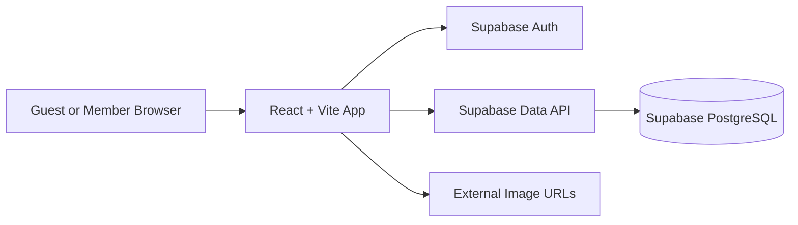

# Technical Design

## Project

- **Project:** Volunteer Social Hub
- **Document:** Technical Design
- **Status:** Revised technical direction approved for implementation planning
- **Related documents:**
  - `docs/01-mini-prd.md`
  - `docs/02-data-model-and-erd.md`

---

## 1. Technical Objectives

The implementation must:

1. Complete all required product features.
2. Use simple, direct React and Supabase patterns throughout the application.
3. Keep authentication and relational data handling intentionally small.
4. Allow guests to read.
5. Require login through the normal UI for all write actions.
6. Associate posts and comments with profiles.
7. Remain small enough for the current deadline.
8. Avoid a custom backend and unnecessary libraries.

---

## 2. Technology Stack

### Frontend

- React
- Vite
- React Router
- JavaScript
- Plain CSS

### Data and Authentication

- Supabase PostgreSQL
- Supabase Auth with email/password
- Supabase Storage for uploaded post images
- `@supabase/supabase-js`

### Optional Deployment

- Netlify after the core submission is complete

### Deliberately Not Used

- Express backend
- Redux
- React Query
- TypeScript
- Tailwind
- UI component framework
- ORM
- Custom REST API
- PostgreSQL RPC for the MVP
- Complex RLS policies for the MVP

---

## 3. Implementation Conventions

Use the following patterns consistently:

- Functional React components
- Props for passing data and callbacks
- `useState` for local component state
- Controlled forms with object state
- `useEffect` for initial data loading and route-dependent fetches
- `.map()` for rendering lists
- `.filter()` for client-side search
- React Router with `Link`, `Outlet`, and `useParams`
- Direct Supabase CRUD calls with `select`, `insert`, `update`, `delete`, and `order`
- Plain CSS without a UI framework
- Small components and page files without unnecessary abstraction layers

Basic Supabase Auth uses:

- `signUp`
- `signInWithPassword`
- `signOut`
- `getSession`
- `onAuthStateChange`

---

## 4. System Context



The browser communicates directly with Supabase using the publishable client key.

---

## 5. RLS Decision

### MVP Decision

Row Level Security is disabled on the application tables for the initial MVP.

This keeps the first implementation small and reduces database-policy setup during core feature development.

### What Authentication Still Does

Supabase Auth still:

- Creates accounts
- Verifies email/password credentials
- Returns a user ID
- Maintains a session
- Allows the app to display member or guest behavior

Turning RLS off does not turn authentication off.

### What Is Not Enforced by the Database

With RLS disabled:

- The React UI checks whether a user is signed in.
- The React UI checks whether the current user is the post author.
- These checks guide normal users through the intended experience.
- A technically knowledgeable person could bypass the UI and call the public Supabase API directly.

Therefore, this version is suitable only for an MVP using sample or non-sensitive data.

### Future Hardening

Before any real deployment that uses private or sensitive data:

1. Enable RLS.
2. Add guest-read policies.
3. Add authenticated insert policies.
4. Add author-only update/delete policies.
5. Replace direct upvote updates with a safer database function or dedicated model.

---

## 6. Suggested Source Structure

```text
src/
├── components/
│   ├── Card.jsx
│   ├── PostImagesInput.jsx
│   ├── Navbar.jsx
│   ├── Comment.jsx
│   └── CommentForm.jsx
├── pages/
│   ├── Profile.jsx
│   ├── EditProfile.jsx
│   ├── ReadPosts.jsx
│   ├── CreatePost.jsx
│   ├── PostDetail.jsx
│   ├── EditPost.jsx
│   ├── Login.jsx
│   ├── Signup.jsx
│   └── NotFound.jsx
├── routes/
│   └── Layout.jsx
├── utils/
│   └── postImages.js
├── client.js
├── App.jsx
├── App.css
├── index.css
└── main.jsx
```

Do not create repository, service, context, or custom-hook layers before they are needed.

Session and current profile may remain in `App.jsx` and be passed through props.

---

## 7. Environment Configuration

Create a local `.env` file:

```text
VITE_SUPABASE_URL=...
VITE_SUPABASE_PUBLISHABLE_KEY=...
```

`src/client.js`:

```js
import { createClient } from "@supabase/supabase-js";

const URL = import.meta.env.VITE_SUPABASE_URL;
const API_KEY = import.meta.env.VITE_SUPABASE_PUBLISHABLE_KEY;

export const supabase = createClient(URL, API_KEY);
```

Also create `.env.example` with variable names only.

The Supabase publishable key is expected to be used by the browser. Never put a service-role or secret key in the React project.

---

## 8. Application Routes

Use `BrowserRouter`, nested routes, `Layout`, and `Outlet` for shared navigation and page rendering.

| Route | Page |
|---|---|
| `/` | ReadPosts |
| `/profiles/:id` | Profile |
| `/profile/edit` | EditProfile |
| `/posts/new` | CreatePost |
| `/posts/:id` | PostDetail |
| `/posts/:id/edit` | EditPost |
| `/login` | Login |
| `/signup` | Signup |
| `*` | NotFound |

Use `Link` for normal navigation and `useParams()` for post IDs.

For redirects after database operations, `window.location` is acceptable for this small application.

---

## 9. Authentication Design

### Signup Form

Fields:

- Display name
- Email
- Password

Simplest flow:

```text
Submit signup form
→ supabase.auth.signUp(email, password)
→ Receive user ID
→ Insert profiles row with ID and display name
→ Redirect home
```

Email confirmation is disabled for the demo.

### Login Form

Fields:

- Email
- Password

Use:

```text
supabase.auth.signInWithPassword(...)
```

After login:

- Save or refresh session state.
- Fetch the profile matching the Auth user ID.
- Display the member name in the navigation.

### Logout

Use:

```text
supabase.auth.signOut()
```

### Session State

`App.jsx` may contain:

```text
session
currentProfile
```

On startup:

1. Call `supabase.auth.getSession()`.
2. Listen with `supabase.auth.onAuthStateChange()`.
3. Fetch the matching profile when a session exists.

No Auth Context is required for the MVP.

### Profile Pages

`/profiles/:id` is publicly readable and displays the member's profile and posts.

`/profile/edit` requires a session and always updates the profile matching the current Auth user ID.

Profile editing supports:

- Display name
- Avatar URL
- Bio

After a successful update, `App.jsx` refreshes `currentProfile` so the navigation updates without a page refresh.

### Basic Profile Failure Handling

If signup creates the Auth account but profile insertion fails:

- Show an error.
- Allow the signed-in user to submit a display name again.
- Do not build a complex automated recovery system.

---

## 10. Guest and Ownership Checks

Create small checks directly in event handlers.

### Guest Write Attempt

Before create, comment, or upvote:

```text
If no session
→ alert("Please log in to continue.")
→ return
```

The controls remain visible to guests.

### Post Ownership

Show edit/delete controls only when:

```text
session.user.id === post.author_id
```

The Edit page also performs the same check before sending an update.

This is application behavior, not production-grade database authorization while RLS is disabled.

---

## 11. Form Pattern

Use one controlled object state for create and edit forms.

```js
const [post, setPost] = useState({
  title: "",
  content: "",
});

const [images, setImages] = useState([]);
```

```js
const handleChange = (event) => {
  setPost((prevState) => ({
    ...prevState,
    [event.target.name]: event.target.value,
  }));
};
```

Use the same form shape for create and edit when practical.

Do not add a form library.

### Post Image Input and Storage

Post create and edit forms use the reusable `PostImagesInput` component.

The component supports:

- Selecting multiple local image files
- Adding direct external image URLs
- Combining uploaded files and URLs
- Previewing selected images
- Removing images before submission
- A maximum of six images

Local validation requires:

- An image MIME type
- A maximum file size of 5 MB
- A maximum resolution of 4096 × 4096 pixels

Uploaded post files use:

```text
Bucket: community-media
Path: <user-id>/posts/<unique-file-name>
```

`src/utils/postImages.js` validates images, uploads local files, obtains public URLs, and resolves the final ordered URL array.

The application stores the complete ordered array in `posts.image_urls`.

---

## 12. Feed Read and Sort

Use `useEffect()` to load posts.

Logical query:

```js
const { data, error } = await supabase
  .from("posts")
  .select("id, title, upvotes, created_at")
  .order(orderBy, { ascending: false });
```

`orderBy` is either:

```text
created_at
upvotes
```

Only fields required by the feed card are selected.

---

## 13. Search

Search runs on the posts already loaded into React state.

Use the following state-and-filter pattern:

```text
searchInput
filteredResults
posts.filter(...)
```

Search compares lowercase post titles with lowercase user input.

This avoids a database request for each keystroke and is sufficient for the small demo dataset.

---

## 14. Post Detail and Author Data

Use `useParams()` to read the post ID.

The post detail needs:

- Post fields
- Author display name
- Optional avatar
- Comments and their authors

Preferred Supabase approach:

```text
Select post with related profile
Select comments with related profiles
```

This relationship query is a small addition beyond the labs and depends on the configured foreign keys.

If the nested relationship query causes a blocker, fallback behavior is:

1. Fetch the post.
2. Fetch the author profile by `author_id`.
3. Fetch comments.
4. Fetch the small set of required profiles separately.

Use the simplest working option.

---

## 15. Create Post

Before insert:

- Confirm a session exists.
- Trim and validate the title.

Logical operation:

```js
const imageUrls = await resolvePostImageUrls(
  images,
  session.user.id,
);

await supabase.from("posts").insert({
  title: post.title.trim(),
  content: post.content.trim() || null,
  image_urls: imageUrls,
  author_id: session.user.id,
  upvotes: 0,
});
```

After success, redirect to the created post detail page if the returned ID is available. Redirecting home is an acceptable fallback.

---

## 16. Edit Post

Load the current post and prefill the controlled form.

Before update:

- Confirm a session exists.
- Confirm the session user ID equals `author_id`.
- Validate the title.

Use a direct Supabase update:

```js
const imageUrls = await resolvePostImageUrls(
  images,
  session.user.id,
);

await supabase
  .from("posts")
  .update({
    title: post.title.trim(),
    content: post.content.trim() || null,
    image_urls: imageUrls,
  })
  .eq("id", id);
```

Redirect to the post detail page after success.

---

## 17. Delete Post

Only show the delete button to the post author.

Use `window.confirm()` before deletion.

```js
await supabase
  .from("posts")
  .delete()
  .eq("id", id);
```

The database foreign key deletes related comments through `ON DELETE CASCADE`.

Redirect home after success.

---

## 18. Upward-Arrow Count

Use a direct count-update pattern.

Flow:

1. Confirm a session exists.
2. Read the current post count already displayed.
3. Update the row with `upvotes + 1`.
4. Update local React state.

Logical operation:

```js
await supabase
  .from("posts")
  .update({ upvotes: post.upvotes + 1 })
  .eq("id", post.id);
```

This is intentionally simple and not atomic under heavy concurrency. That limitation is acceptable for the initial MVP.

---

## 19. Comments

### Read

Load comments for one post and order by creation time:

```js
await supabase
  .from("comments")
  .select()
  .eq("post_id", id)
  .order("created_at", { ascending: true });
```

Author profiles are joined or fetched separately.

### Create

Before insert:

- Confirm a session exists.
- Trim and validate comment content.

```js
await supabase
  .from("comments")
  .insert({
    post_id: id,
    author_id: session.user.id,
    content: comment.trim(),
  });
```

After success:

- Clear the input.
- Fetch comments again or append the returned comment.

### Future Edit/Delete

The stored `author_id` supports future author checks. The UI is not included in the required MVP.

---

## 20. Loading, Empty, and Error States

Use simple conditional rendering in each page rather than creating many abstraction components.

Examples:

```text
Loading posts...
No posts yet.
No posts match your search.
No comments yet.
Post not found.
Unable to save your post.
```

Use `alert()` for simple action errors and login-required prompts if that saves time.

Log the Supabase error to the browser console during development.

---

## 21. Database Setup

Create three tables:

- `profiles`
- `posts`
- `comments`

Required relationships:

- `profiles.id` matches Supabase Auth user IDs.
- `posts.author_id` references `profiles.id`.
- `comments.author_id` references `profiles.id`.
- `comments.post_id` references `posts.id` with `ON DELETE CASCADE`.

Disable RLS on these application tables for the initial MVP.

Do not enable Realtime unless a feature needs it.

---

## 22. Privacy and Security Limitations

The MVP must not contain real confidential or internal organizational data.

The UI provides:

- Guest/member behavior
- Login checks
- Author checks

The database does not strongly enforce these rules while RLS is disabled.

Before real deployment:

- Enable RLS
- Add access policies
- Protect ownership at the database layer
- Review Auth configuration
- Add moderation and reporting where appropriate

---

## 23. Testing Priorities

### Required Happy Paths

1. Guest can browse and read.
2. Guest clicks a write control and receives a login prompt.
3. User can sign up.
4. User can log in and log out.
5. Member can create a post.
6. Feed search works.
7. Both sorts work.
8. Member can open a post.
9. Member can repeatedly click the upward arrow.
10. Member can comment.
11. Author can edit their post.
12. Author can delete their post.
13. Deleting a post removes its comments.
14. Refresh preserves data.

### Ownership UI Test

- Account A creates a post.
- Account B signs in.
- Account B does not see edit/delete controls for Account A’s post.

This verifies intended UI behavior, not database security.

---

## 24. Deployment

Local operation is required.

Netlify is optional after:

1. Core features work.
2. README is complete.
3. GIF is complete.

When deploying a React Router SPA, configure a rewrite to `index.html` so direct route refreshes work.

Add the Supabase environment values in Netlify.

---

## 25. Implementation Priorities

### P0

- Project setup and routes
- Supabase tables and client
- Basic Auth and profiles
- Read/create/edit/delete posts
- Post detail
- Upward-arrow count
- Comments
- Search and sort
- Demo data
- README and GIF

### P1

- Avatar and bio editing
- Better responsive layout
- Netlify deployment

### Future Security

- RLS
- Database policies
- Safer atomic upvote
- Google sign-in
- Private organization domain restriction
