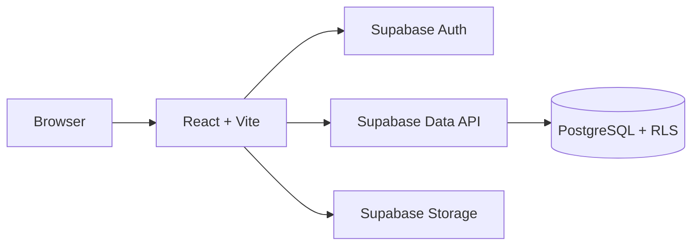

# Volunteer Social Hub — Technical Overview

## Architecture

Volunteer Social Hub is a client-side React application built with Vite.

The browser communicates directly with Supabase for:

- Authentication
- PostgreSQL data access
- Image storage
- Scoped database functions

The application does not use a separate custom backend server.



## Technology Stack

### Frontend

- React
- Vite
- React Router
- JavaScript
- Plain CSS

### Backend Services

- Supabase PostgreSQL
- Supabase Auth
- Supabase Storage
- Supabase Data API
- PostgreSQL Row Level Security and database functions
- `@supabase/supabase-js`

### Deployment

- Netlify

## Application Structure

The project uses page components for route-level screens and smaller reusable components for shared UI behavior.

```text
src/
├── components/
│   ├── Avatar.jsx
│   ├── Card.jsx
│   ├── ImageCarousel.jsx
│   └── PostImagesInput.jsx
├── constants/
│   └── postCategories.js
├── pages/
│   ├── CreatePost.jsx
│   ├── EditPost.jsx
│   ├── EditProfile.jsx
│   ├── Login.jsx
│   ├── NotFound.jsx
│   ├── PostDetail.jsx
│   ├── Profile.jsx
│   ├── ReadPosts.jsx
│   └── Signup.jsx
├── routes/
│   ├── Layout.jsx
│   └── RequireAuth.jsx
├── utils/
│   └── mediaImages.js
├── App.jsx
├── App.css
├── client.js
├── index.css
└── main.jsx
```

Database migrations and policy definitions are stored under `supabase/`.

## Routing

React Router handles navigation between the main application screens.

| Route | Purpose |
| --- | --- |
| `/` | Community feed |
| `/profiles/:id` | Public member profile |
| `/profile/edit` | Edit the signed-in user's profile |
| `/posts/new` | Create a post |
| `/posts/:id` | View a post and its comments |
| `/posts/:id/edit` | Edit an owned post |
| `/login` | Sign in |
| `/signup` | Create an account |
| `*` | Not-found page |

Shared navigation and layout are handled by `Layout.jsx`.

Protected routes use `RequireAuth.jsx`.

## Authentication and Session Handling

Supabase Auth provides email/password registration, sign-in, sign-out, and persistent sessions.

`App.jsx` maintains authentication and profile state.

The Supabase Auth user ID connects authenticated users to their profiles, posts, and comments.

Guests can browse public content, while write actions require authentication.

New users send `display_name` through Auth metadata during sign-up. An `on_auth_user_created` PostgreSQL trigger creates the corresponding `public.profiles` row, so the browser does not need direct profile-insert permission.

## Data Access and Authorization

The application uses Supabase queries directly from React, but authorization is enforced by PostgreSQL rather than trusted only to client-side checks.

Row Level Security is enabled on `profiles`, `posts`, and `comments`.

The policy model is:

- Public read access to profiles, posts, and comments
- Authenticated post and comment creation only when `author_id` matches the signed-in user
- Owner-only profile updates
- Owner-only post updates and deletion
- Owner-only comment updates and deletion

Least-privilege column grants restrict which fields the browser can write. For example, authenticated clients can edit post content fields but cannot directly set `upvotes`, `created_at`, or another `author_id`.

The UI still performs ownership checks to show the appropriate controls, while RLS independently enforces the same boundary at the database layer.

The policy and grant definitions are in `supabase/security-hardening.sql`.

## Secure Support / Upvote Flow

Post support is stored as a numeric counter.

The browser does not perform a generic `UPDATE posts SET upvotes = ...`. Instead, `PostDetail.jsx` calls the authenticated `increment_post_upvotes` RPC.

The PostgreSQL function performs an atomic increment:

```text
upvotes = upvotes + 1
```

This prevents clients from setting arbitrary vote counts and avoids the read-modify-write race condition that can occur when multiple users increment the same value concurrently.

## Data Access Workflows

Common operations include:

- Selecting posts, profiles, and comments
- Creating posts as the authenticated user
- Updating and deleting owned posts
- Creating comments as the authenticated user
- Updating and deleting owned comments
- Reading and updating the signed-in user's profile
- Incrementing support through a scoped RPC
- Sorting posts by creation time or support count

Search and category filtering are performed on the loaded post data in the client.

This direct data-access approach keeps the application architecture small while RLS, grants, triggers, and scoped functions protect the exposed database API.

## Post Media

`PostImagesInput.jsx` handles image selection and preview behavior for create and edit flows.

`mediaImages.js` handles:

- Uploaded-file validation
- External image URL validation
- File-size checks
- Image-dimension checks
- Uploads to Supabase Storage
- Resolution of the final ordered image URL list

Posts can contain up to six images.

Uploaded files are stored in the public `community-media` Supabase Storage bucket under a path owned by the authenticated user. Storage write policies restrict authenticated uploads and updates to that user's path.

`ImageCarousel.jsx` displays multiple post images with manual navigation.

## Feed and Discovery

`ReadPosts.jsx` loads posts and provides:

- Newest-first sorting
- Most-supported sorting
- Title search
- Category filtering

`Card.jsx` renders feed items and links users to post and author details.

## Post Detail and Interaction

`PostDetail.jsx` handles the discussion experience for a post.

It includes:

- Post content and images
- Author information
- Support count
- Comments
- Comment creation
- Editing and deleting owned comments
- Editing and deleting owned posts
- Authenticated support through the database RPC

Support activity allows repeated clicks; individual voters are not tracked in a separate table.

## Profiles

Each authenticated user has a public profile.

Profile functionality includes:

- Display name
- Avatar
- Bio
- Posts authored by that member

Users can edit their own profile through the protected profile-edit route, and RLS restricts the database update to the profile owner.

## Environment Configuration

The application expects Supabase configuration through Vite environment variables:

```text
VITE_SUPABASE_URL
VITE_SUPABASE_PUBLISHABLE_KEY
```

A Supabase service-role or secret key must not be included in the client application.

## Formatting and Code Quality

The repository uses:

- ESLint for code-quality checks
- Prettier for consistent formatting
- Vite production builds for build verification

Useful commands include:

```text
npm run lint
npm run format
npm run format:check
npm run build
```
